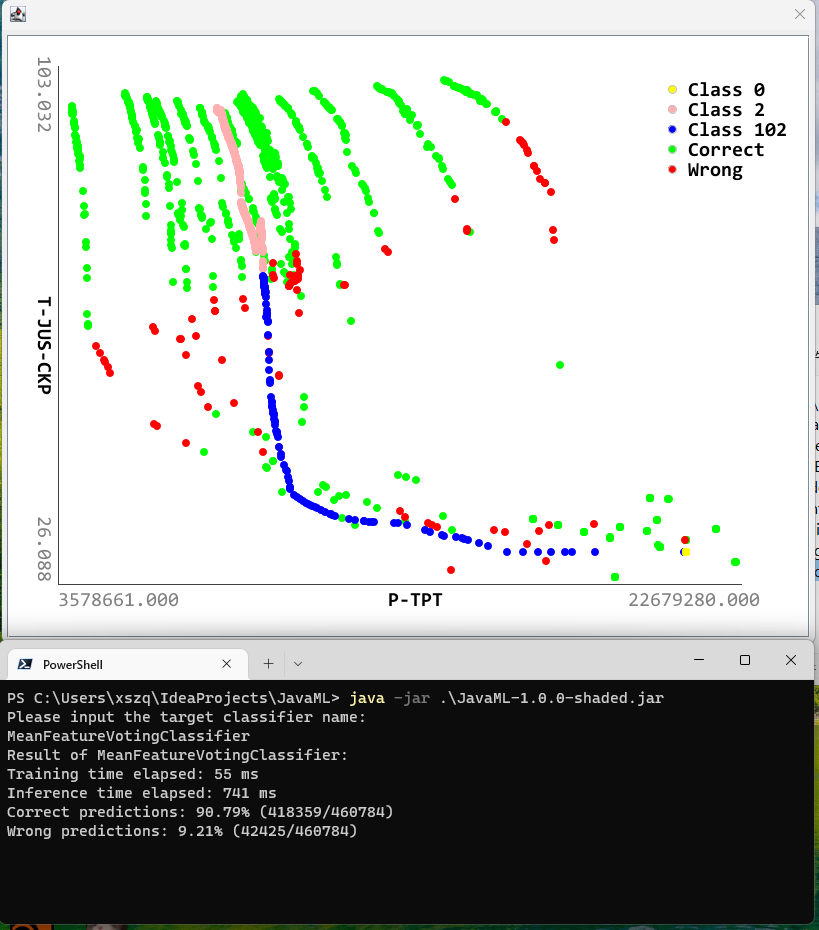

# Java Course Homework: JavaML Classification Task

## Introduction
This is a homework assigned by my teacher of Java course in SDUW. The aim of this homework is to learn the class and object in Java and their usage.

For detailed instructions of the implementation, please read the introduction.pdf.



## Getting Started
You can `git clone` and import this project into IDEA (Recommended) or Eclipse and Run class `JavaML`, or pack shaded jar from source using Maven, or just simply execute the compiled jar:
```
java -jar JavaML-1.0.0-shaded.jar
```

## Dataset
The 3W dataset is used in this project, you can check here -> [link](https://github.com/ricardovvargas/3w_dataset)